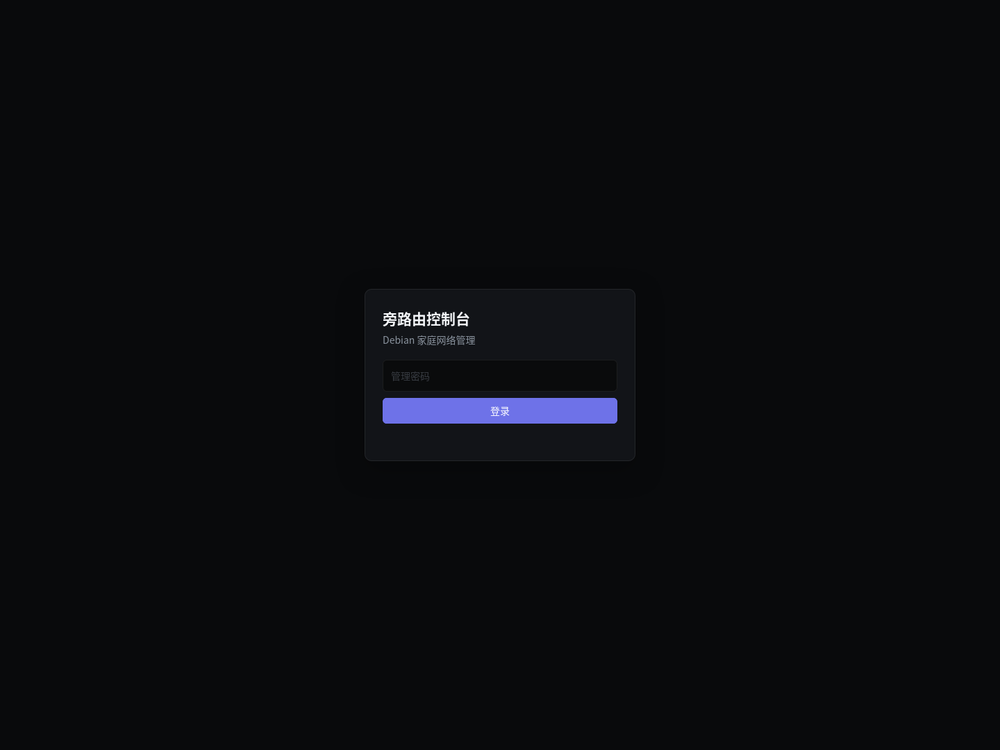

# Debian 可复制旁路由项目

> **面向 Debian 13 的参数化家庭旁路由部署项目**：集成 Mihomo、MosDNS、AdGuard Home、nftables/TProxy、systemd 与 Web 控制台。
>
> 当前状态：**已通过本地、隔离生命周期和 CI 校验；尚未完成干净 Debian 13 虚拟机的全链路验收，因此不是 release-ready。**

[](https://github.com/wtice9527/bypass-router-project/actions/workflows/ci.yml)

## 它解决什么问题

- 把一台 Debian 主机部署为**旁路由**，而不是修改主路由；
- LAN 客户端可按需把 IPv4 网关和 DNS 指向旁路由；
- 国内 DNS 使用加密国内 DoH，全球 DNS 经 Mihomo 使用加密 DoH；**不提供公网明文 53 fallback**；
- TCP 使用 Redirect、UDP 使用 TProxy；
- 提供节点、订阅、规则、AdGuard、服务、透明代理与诊断的 Web 控制台；
- 支持配置校验、生成、安装、升级、回滚、卸载与状态检查；
- 发布目录不包含订阅、节点、Token、密码、私钥或原生产网络身份。

## 适用范围与前提

| 项目 | 要求 |
|---|---|
| 系统 | Debian 13；IPv4 LAN |
| 架构 | `amd64` 或 `arm64`（自动获取核心二进制） |
| 权限 | 安装需要 `root` / `sudo` |
| 网络 | 安装时可访问 Debian 软件源与 GitHub Releases |
| 带外访问 | 强烈建议保留虚拟机/物理控制台或已可用的 Tailscale |
| 客户端接管 | 仅把网关和 DNS 设置为旁路由 IP 的客户端会进入旁路由路径 |

> 项目**不会修改主路由 DHCP**，也不会自动把全网设备切换到旁路由。

## 5 分钟交互部署

```bash
git clone https://github.com/wtice9527/bypass-router-project.git
cd bypass-router-project
sudo ./install.sh
```

安装器会：

1. 检查 Debian 与 root 权限；
2. 安装基础依赖并创建 Python 虚拟环境；
3. 交互收集参数、校验输入并显示摘要；
4. 在缺失时下载 Mihomo、MosDNS、AdGuard Home，并校验上游 SHA-256 digest；
5. 写入配置、创建运行/状态目录、启用服务、应用订阅；
6. 输出 Web 访问地址和恢复入口。

### 向导需要你确认的内容

| 类别 | 参数 |
|---|---|
| 网络 | LAN 接口、LAN CIDR、旁路由本机 IPv4、上游网关 |
| 管理 | Web 监听地址/端口、当前 sshd 监听端口、Tailscale 管理访问 |
| DNS | 国内加密 DoH、全球代理 DoH |
| 代理 | HTTPS 订阅 URL、健康检测 URL |
| 稳定性 | Watchdog 连续失败阈值、冷却时间 |
| 安全 | Web 管理密码（无回显输入、二次确认、至少 12 字符） |
| 可选高影响动作 | 是否由 NetworkManager 修改本机静态 IPv4（默认**否**） |

完整流程与风险说明见：[交互部署指南](docs/INTERACTIVE_INSTALL.md)。

## Web 管理控制台

部署完成后，可通过 Web 控制台管理节点、订阅、规则、AdGuard、服务、透明代理与诊断。



> 示例截图不包含真实密码、订阅、节点、IP 地址或流量数据。控制台地址为 `http://旁路由IP:Web端口`。

## 部署后：让客户端使用旁路由

安装成功不代表客户端已经走旁路由。需要在目标客户端手动设置：

```text
IPv4 网关 = 旁路由本机 IPv4
DNS       = 旁路由本机 IPv4
```

确认稳定后，如需全网接管，请由管理员自行在主路由 DHCP 中做配置；这不属于安装器的自动操作范围。

## 访问与检查

Web 控制台地址：

```text
http://旁路由IP:Web端口
```

常用检查命令：

```bash
sudo .venv/bin/routerctl status
systemctl --no-pager --full status mihomo mosdns adguardhome \
  bypass-router-tproxy bypass-router-web
ip rule show
ip route show table 100
sudo nft list table inet bypass_router
```

## 不使用交互模式

高级用户或 CI 可自行准备 `config.json` 与 `secrets.json`：

```bash
python3 -m venv .venv
.venv/bin/pip install -e .

# 校验，不写入系统
.venv/bin/routerctl validate -c config.json -s secrets.json
.venv/bin/routerctl generate -c config.json -o build/rootfs

# 在临时目录演练完整生命周期
TMP=$(mktemp -d)
.venv/bin/routerctl install -c config.json -s secrets.json --prefix "$TMP" --yes
.venv/bin/routerctl status --prefix "$TMP"
.venv/bin/routerctl upgrade -c config.json -s secrets.json --prefix "$TMP" --yes
.venv/bin/routerctl rollback --prefix "$TMP" --yes
.venv/bin/routerctl uninstall --prefix "$TMP" --yes

# 生产安装（必须保留带外管理通道）
sudo .venv/bin/routerctl install -c config.json -s secrets.json --yes
```

## 配置与秘密

- `config.json`：网络、端口、DNS、策略路由、Watchdog 等非秘密参数；
- `secrets.json`：订阅 URL 与 Web 管理密码；由向导创建时权限为 `0600`；
- 两个文件均被 Git 忽略；**不要提交、截图或粘贴到 Issue。**

配置样例：

```text
config.example.json
secrets.example.json
```

## 生命周期命令

| 命令 | 作用 |
|---|---|
| `routerctl wizard` | 交互生成配置；加 `--install --bootstrap` 可执行完整安装 |
| `routerctl validate` | 校验参数、模板与可用的原生检查器 |
| `routerctl generate` | 生成脱敏 rootfs，不修改系统 |
| `routerctl install` | 备份、安装、启用服务并记录 manifest |
| `routerctl upgrade` | 备份当前版本、覆盖并清理旧文件 |
| `routerctl rollback` | 恢复指定或最近备份 |
| `routerctl uninstall` | 删除 manifest 管理的文件并保留恢复点 |
| `routerctl status` | 检查版本、文件漂移和服务状态 |

## 安全边界

- 订阅 URL 只允许 HTTPS；
- Web 密码使用 scrypt 哈希保存；
- Mihomo Controller 只监听回环；
- 公网 DNS 仅允许 DoH/DoT，没有明文 53 fallback；
- 外部数据在 Web 前端转义，写操作要求认证和 CSRF；
- 发布前 CI 执行测试、敏感信息扫描、模板渲染、Python/JavaScript/nftables 检查；
- 生产安装会修改防火墙、策略路由、DNS 与服务状态，务必保留带外管理。

漏洞报告方式请见 [SECURITY.md](SECURITY.md)。

## 文档导航

- [交互部署指南](docs/INTERACTIVE_INSTALL.md)
- [使用 Hermes 管理与维护旁路由](docs/HERMES_OPERATIONS.md)
- [架构说明](docs/architecture.md)
- [验收清单与已知边界](docs/ACCEPTANCE.md)
- [贡献指南](CONTRIBUTING.md)
- [安全策略](SECURITY.md)

## 许可证

[MIT](LICENSE)
